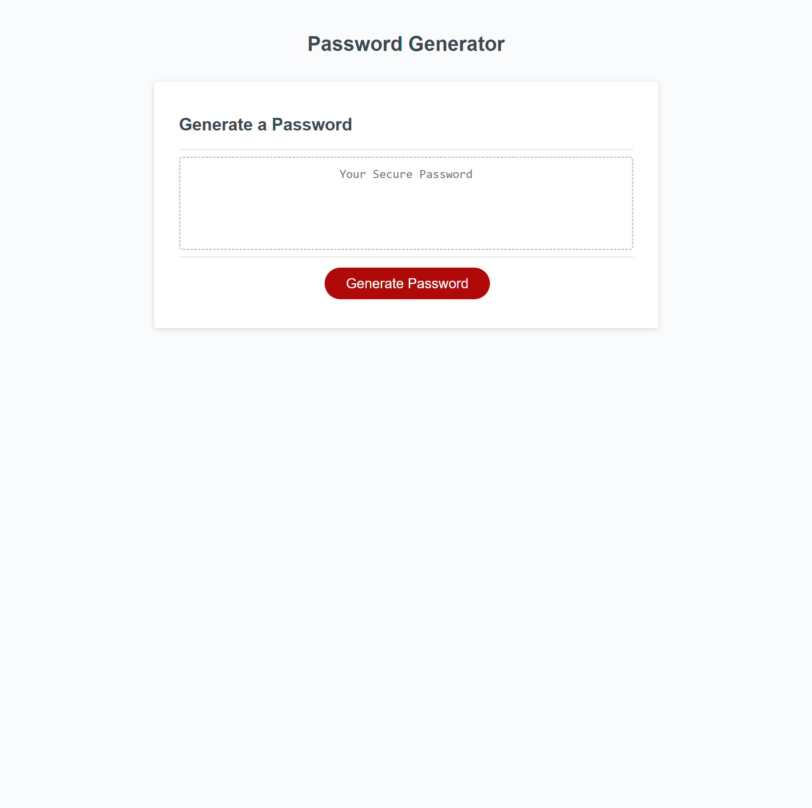

# Password Generator

## Description

Password Generator website. After the user has selected the length, and which type of characters they want, a random password based on the criteria selected will be displayed on screen.

## Table of Contents

* [Installation](#installation)
* [Usage](#usage)
* [Credits](#credits)
* [License](#license)
* [Badges](#badges)

## Installation

N/A

## Usage 

Go To: [codrincarpovici.github.io/password-generator/](https://codrincarpovici.github.io/password-generator/) and view the website. 

Once on the website click on the generate password button. You will then be given a series of prompts that will ask you the criteria for the password you want to generate. The criteria's are: length, lower case, upper case, numeric and special characters. If at least the length has been input and one type of character is selected then it will generate a password, if not it will return undefined as it doesn't satisfy the criteria.

## Credits

N/A

## License
N/A

## Badges

